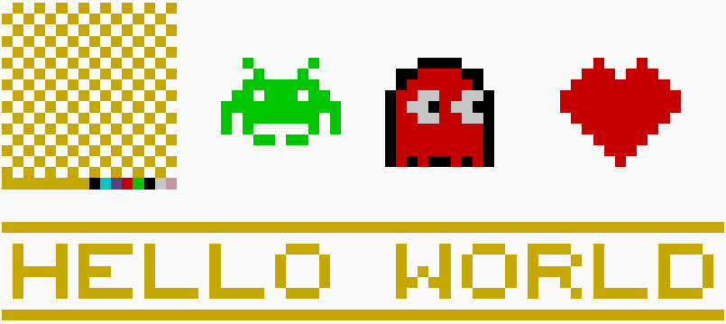
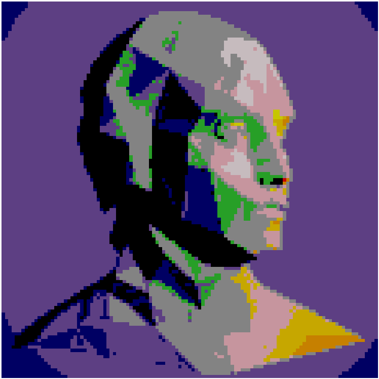

# pixelArtSCAD

PixelArtSCAD is an OpenSCAD library for creating customizable 3D pixel art using character-based arrays and color maps. This library enables users to define pixel patterns and assign colors based on a pre-defined colormap, making it easy to generate detailed 3D models of pixel art.

## Features

- **Dynamic Pixel Patterns**: Use predefined or custom character arrays to generate pixel art.
- **Customizable Pixel Dimensions**: Control the size and thickness of each pixel in the 3D model.
- **Colormap Support**: Use the `colormap.scad` file to define the color mapping for characters.
- **Python Integration**: Includes a Python script to convert PNG images into character arrays compatible with OpenSCAD.

## Examples

The `examples` folder showcases various use cases of the library, demonstrating how to create and manipulate pixel art in OpenSCAD.

### `sample_pixel_art_gallery.scad`



This example illustrates how to manually define pixel art matrices and display them in OpenSCAD.

---

### `sample_pixel_art_fastlogo.scad`


This example demonstrates the use of a converted PNG image. A simple character search-and-replace was applied to modify the color scheme from a black logo on a transparent bacground (as in the original image) to a purple logo on a white background.

---

### `sample_pixel_art_ckbGH.scad`



You can see that the current colormap could use some further expansion (and the Python RGB mapping could also probably use some tweaks). Regardless I think it creates some pretty intriguing abstract art.

## Getting Started

### Using the SCAD Library

Include the `pixel_art.scad` file in your OpenSCAD project and define a character array to use with the `PixArt` module.

#### Example: Basic Pixel Art

```
use <pixel_art.scad>;

PixAlien = [
    "  G     G  ",
    "   G   G   ",
    "  GGGGGGG  ",
    " GG GGG GG ",
    "GGGGGGGGGGG",
    "G GGGGGGG G",
    "G G     G G",
    "   GG GG   "
    ];

PixArt(H=PixAlien);

```

### Generating SCAD Arrays from PNGs

The included Python script customPixPngExtract.py allows you to convert PNG images into SCAD-compatible character arrays.
Requirements

- Python 3.x
- Pillow library (pip install pillow)

#### Usage

1. Prepare a PNG image.
2. Define your colormap in colormap.scad (or use the default).
3. Define your parameters in the script:

```
resolution = 4  # Adjust resolution
var_name = "PixCustom"  # Custom array name
input_name = "MyPic.png"  # Input image file
output_name = "customPixArrayArray.scad"  # Output SCAD file
colormap_name = "colormap.scad"  # Colormap file
```

4. Run the script:

```
python customPixPngExtract.py
```

The script generates a SCAD array file (e.g., customPixArrayArray.scad) in the same directory.

## Colormap Definition

The colormap.scad file maps characters to RGB colors and includes a function to normalize the values from 0.0 to 1.0, according to OpenSCAD convention. The default is given as:

```
colorMap255 = [
    ["0", [0, 0, 0]],         // Black
    ["1", [255, 215, 0]],     // Gold
    ["%", [255, 240, 245]],   // LavenderBlush
    ["B", [0, 0, 0]],         // Black
    ["W", [255, 255, 255]],   // White
    ["R", [255, 0, 0]],       // Red
    ["G", [0, 255, 0]],       // Green
    ["P", [255, 192, 203]],   // Pink
    ["V", [120, 81, 169]],    // Royal Purple
    ["Y", [255, 255, 0]],     // Yellow
    ["O", [255, 165, 0]],     // Orange
    ["C", [0, 255, 255]],     // Cyan
    ["M", [255, 0, 255]],     // Magenta
    ["N", [0, 0, 128]],       // Navy
    ["L", [50, 205, 50]],     // Lime
    ["D", [169, 169, 169]],   // DarkGray
    [" ", [255, 215, 0]]      // Default [Gold for space]
];
```

## License

This project is licensed under the MIT License.

## Contributions

Contributions are welcome! If you have suggestions or improvements, feel free to create an issue or submit a pull request.

## Acknowledgments

This library is inspired by the need for easy 3D pixel art generation and integrates Python utilities for seamless image-to-SCAD workflows. It is also inspired by [Pixel Art - OpenSCAD by VincentD](https://www.thingiverse.com/thing:1217811) (CC0 1.0 Universal), which laid the groundwork for pixel art creation in OpenSCAD .
